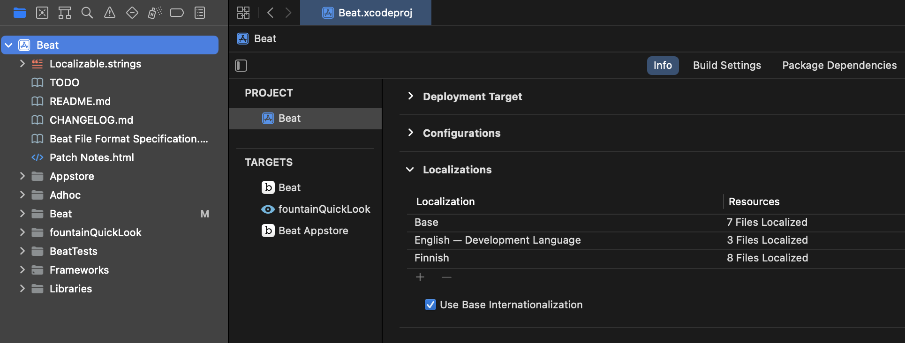

# Translation Guide

Thank you for your interest in making Beat more accessible to speakers of other languages! The following is a guide for translating UI elements in the app.

The best way to do this is with [Xcode](https://developer.apple.com/xcode/). Open `Beat.xcworkspace` with Xcode, and see the Info on the project as below:



The Localizations section will show the languages that the app currently supports. The base language is English. To add a new language, click on the plus sign. This will open the localization creation window:


Uncheck `PreviewViewController.xib`, `UnzipKit.strings`, and `InfoPlist.strings` as shown in the image above—those are not necessary. Within the Xcode project, these are the locations of the seven other files, which you must update to your contributed language:
- Beat ▸ Localizable.strings
- Beat ▸ Beat ▸ Document.xib
- Beat ▸ Beat ▸ MainMenu.xib
- Beat ▸ Beat ▸ User Interface ▸ Preferences ▸ BeatPreferencesPanel.xib
- Beat ▸ Beat ▸ User Interface ▸ Title Page Editor ▸ BeatTitlePageEditor.xib
- Beat ▸ Beat ▸ User Interface ▸ Themes ▸ Theme Editor ▸ ThemeEditor.xib
- Beat ▸ Beat ▸ Export ▸ BeatEpisodePrinter ▸ BeatEpisodePrinter.xib
For each file, choose the existing language that you would like to use as reference when translating terms in all the files.

Click Finish. The STRINGS files corresponding to the newly-added language will be created under the XIB directories.


These are the files that you must edit. Their paths from the repo directory in the file system are
- `[lang].lproj/Localizable.strings`
- `Beat/[lang].lproj/Document.strings`
- `Beat/[lang].lproj/MainMenu.strings`
- `Beat/User Interface/Preferences/[lang].lproj/BeatPreferencesPanel.strings`
- `Beat/User Interface/Title Page Editor/[lang].lproj/BeatTitlePageEditor.strings`
- `Beat/User Interface/Themes/Theme Editor/[lang].lproj/ThemeEditor.strings`
- `Beat/Statistics/[lang].lproj/BeatStatisticsPanel.strings`
- `Beat/Export/BeatEpisodePrinter/[lang].lproj/BeatEpisodePrinter.strings`
where `[lang]` is the corresponding two-letter language code.

The contents of each STRINGS file will look like the following:
```
/* Class = "NSToolbarItem"; label = "General"; ObjectID = "2No-Jf-9GH"; */
"2No-Jf-9GH.label" = "General";

/* Class = "NSToolbarItem"; paletteLabel = "General"; ObjectID = "2No-Jf-9GH"; */
"2No-Jf-9GH.paletteLabel" = "General";

/* Class = "NSMenuItem"; title = "US Letter"; ObjectID = "3O7-zn-jUw"; */
"3O7-zn-jUw.title" = "US Letter";

/* Class = "NSButtonCell"; title = "Automatic paragraph breaks"; ObjectID = "5Bc-al-gWv"; */
"5Bc-al-gWv.title" = "Automatic paragraph breaks";

/* Class = "NSMenuItem"; title = "A4"; ObjectID = "7Xj-J1-Y92"; */
"7Xj-J1-Y92.title" = "A4";
```
The values outside of the comments (enclosed between `/*` and `*/`) will be in the reference language that you selected. These are the values for you to edit.


## Guidelines

Make sure that your translations are accurate. Try to use standardized language for common UI elements (such as *Copy*, *Paste* etc.), and strive for clarity and unity.

Screenwriting jargon is often full of anglicisms, and many writers can be accustomed to using English-language words for certain terms (such as *slugline*, *logline* etc.) It's still highly encouraged to use native counterparts and translations for the industry terms.

Silly case in point: In Finnish, people often use the loanwords *"interiööri"* and *"eksteriööri"* in place of interior and exterior, even if the more accessible alternatives *sisätila* and *ulkotila* express the same with less effort. Beat localization opts for the native words.

Note that Beat is a work in progress. Some things might change over time, so the localizations need to be kept up to date. Most UI elements will fall back to the original English values when localization data is not available.


